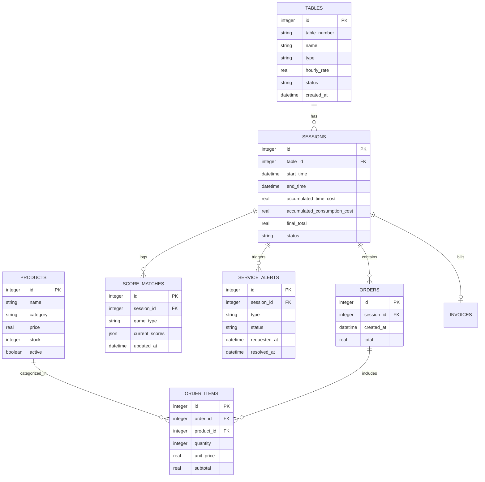

# Especificación Técnica de Arquitectura: BillarPulse
**Sistema POS & Marcador Táctil Offline-First para Salas de Billar**

---

## 1. Resumen Ejecutivo y Objetivos

**BillarPulse** es un sistema integral de gestión y experiencia de juego diseñado específicamente para salones y clubes de billar. Resuelve las dos mayores fricciones del rubro:
1. **Control de tiempos y facturación:** Eliminación de fugas de dinero por errores en cálculo de horas/fracciones de mesa y consumo de barra.
2. **Experiencia del cliente sin fricción:** Marcador interactivo táctil de alta visibilidad en cada mesa que evita discusiones de tanteo y agiliza la atención del personal sin sobrecargar al cliente con menús complejos.

### Principios de Diseño
- **Offline-First Absoluto (100% LAN):** El negocio no se detiene si se corta el servicio de Internet.
- **Resiliencia ante Fallos Eléctricos:** Tiempos y montos calculados por marcas de tiempo (*timestamps*) absolutas persistidas en disco.
- **Cero Fricción en Mesa:** La pantalla táctil del cliente actúa como marcador, cronómetro y llamador de servicio; no es un e-commerce complejo.
- **Ultra-Rápido en Barra/Caja:** Facturación de consumos con un máximo de 2 clics para el cajero.

---

## 2. Arquitectura de Red y Topología de Despliegue

El sistema opera bajo una arquitectura de red de área local (LAN) cliente-servidor con sincronización bidireccional en tiempo real vía WebSockets.

```mermaid
flowchart TD
    subgraph Red Local LAN (Router WiFi 5GHz Dedicado)
        subgraph Servidor Local
            SVR[Mini PC / Servidor Local\nNode.js + Fastify/WS + SQLite]
            DB[(SQLite Local DB\nWAL Mode)]
            SVR <--> DB
        end

        subgraph Área de Caja / Barra
            POS[Terminal POS / PC Caja\nPanel de Administración Web]
            PRN[Impresora Térmica 80mm\n(ESC/POS LAN/USB)]
            POS <-->|WebSocket + REST| SVR
            POS -.->|Impresión| PRN
        end

        subgraph Salón de Billar
            T1[Tablet Mesa 1\nPWA / Modo Kiosco]
            T2[Tablet Mesa 2\nPWA / Modo Kiosco]
            TN[Tablet Mesa N\nPWA / Modo Kiosco]
            
            T1 <-->|WebSocket| SVR
            T2 <-->|WebSocket| SVR
            TN <-->|WebSocket| SVR
        end
    end
```

### Componentes de Infraestructura:
1. **Servidor Local (Host):**
   - Mini PC (Intel N100 / 8GB RAM / SSD 128GB) o Raspberry Pi 4/5 ejecutando Linux (Ubuntu Server o Debian).
   - Expone la API REST, el Servidor WebSocket y sirve los activos estáticos de ambas aplicaciones web.
2. **Router LAN Dedicado:**
   - Router Wi-Fi de doble banda (2.4 GHz para alcance, 5 GHz para menor latencia).
   - Asignación de IPs estáticas / reservas DHCP por dirección MAC para el servidor y las tablets.
3. **Tablets de Mesa (Clientes Kiosco):**
   - Tablets Android (10 pulgadas, 2GB/3GB RAM, resolución 1280x800 o superior).
   - Navegador en Modo Kiosco (ej. *Fully Kiosk Browser* o PWA instalada) bloqueando navegación externa y botones del sistema.
4. **Terminal de Caja / Barra:**
   - Navegador en PC de escritorio o laptop conectada al router vía cable Ethernet (Cat6 recomendado).

---

## 3. Stack Tecnológico Recomendado

| Capa | Tecnología | Justificación |
|---|---|---|
| **Runtime Servidor** | **Node.js (LTS v20+)** | Alto rendimiento I/O para WebSockets concurrentes y bajo consumo de recursos. |
| **Framework HTTP / WS** | **Fastify + `@fastify/websocket`** | Significativamente más rápido que Express; tipado con TypeScript y bajo *overhead*. |
| **Base de Datos** | **SQLite (vía `better-sqlite3` o LibSQL)** | Monolítica, cero configuración, respaldos con un solo archivo copia, soporte ACID completo con `WAL` habilitado. |
| **Frontend Clientes** | **React 18/19 + Vite** | Re-renderizado veloz, tipado fuerte, ecosistema maduro y ligero. |
| **Estilos & UI** | **Vanilla CSS / CSS Modules** | Control total sobre micro-animaciones, tiempos de carga instantáneos y optimización para pantallas táctiles de bajo rendimiento. |
| **Gestión de Estado** | **Zustand** | Huella mínima de memoria en clientes (<2KB) y manejo reactivo de eventos WebSocket. |
| **Impresión Tickets** | **Librería ESC/POS nativa (Node.js)** | Envío de comandos directos a impresoras de tickets térmicas vía USB/Red. |

---

## 4. Modelo de Datos (Esquema SQLite)

El esquema prioriza la integridad de datos, cálculos deterministas y auditoría de consumos.



### Sentencias DDL Iniciales (SQLite):

```sql
PRAGMA journal_mode = WAL;
PRAGMA foreign_keys = ON;

-- Mesas del establecimiento
CREATE TABLE tables (
    id INTEGER PRIMARY KEY AUTOINCREMENT,
    table_number TEXT NOT NULL UNIQUE,
    name TEXT NOT NULL,
    type TEXT DEFAULT 'pool', -- 'pool', 'tres_bandas', 'snooker'
    hourly_rate REAL NOT NULL DEFAULT 0.0,
    status TEXT NOT NULL DEFAULT 'available' -- 'available', 'occupied', 'maintenance'
);

-- Sesiones de juego (Apertura y Cierre de mesa)
CREATE TABLE sessions (
    id INTEGER PRIMARY KEY AUTOINCREMENT,
    table_id INTEGER NOT NULL REFERENCES tables(id),
    start_time TEXT NOT NULL, -- Formato ISO8601 UTC
    end_time TEXT,
    rate_applied REAL NOT NULL,
    total_time_minutes INTEGER DEFAULT 0,
    time_cost REAL DEFAULT 0.0,
    consumption_cost REAL DEFAULT 0.0,
    total_amount REAL DEFAULT 0.0,
    status TEXT NOT NULL DEFAULT 'active' -- 'active', 'closed', 'cancelled'
);

-- Catálogo de productos de barra/snacks
CREATE TABLE products (
    id INTEGER PRIMARY KEY AUTOINCREMENT,
    name TEXT NOT NULL,
    category TEXT NOT NULL, -- 'cervezas', 'licores', 'bebidas', 'snacks'
    price REAL NOT NULL,
    stock INTEGER NOT NULL DEFAULT 0,
    is_active INTEGER DEFAULT 1
);

-- Pedidos vinculados a una sesión
CREATE TABLE orders (
    id INTEGER PRIMARY KEY AUTOINCREMENT,
    session_id INTEGER NOT NULL REFERENCES sessions(id),
    created_at TEXT NOT NULL,
    total REAL NOT NULL DEFAULT 0.0
);

CREATE TABLE order_items (
    id INTEGER PRIMARY KEY AUTOINCREMENT,
    order_id INTEGER NOT NULL REFERENCES orders(id),
    product_id INTEGER NOT NULL REFERENCES products(id),
    quantity INTEGER NOT NULL,
    unit_price REAL NOT NULL,
    subtotal REAL NOT NULL
);

-- Alertas de servicio (Llamar mesero / Pedir cuenta)
CREATE TABLE service_alerts (
    id INTEGER PRIMARY KEY AUTOINCREMENT,
    session_id INTEGER NOT NULL REFERENCES sessions(id),
    type TEXT NOT NULL, -- 'waiter', 'bill'
    status TEXT NOT NULL DEFAULT 'pending', -- 'pending', 'attended', 'dismissed'
    created_at TEXT NOT NULL,
    resolved_at TEXT
);
```

---

## 5. Especificación de la Pantalla de Mesa (Terminal Táctil)

### 5.1 Ergonomía y Filosofía UX/UI
- **Ambiente de Billar:** Diseñado para salones con luz ambiental tenue y focos directos sobre la mesa de juego.
- **Paleta de Colores:** Fondo oscuro OLED (`#0D1117`), contrastes altos en elementos activos (verde esmeralda billar `#00D26A`, dorado `#FFB800`, blanco nítido `#FFFFFF`).
- **Touch Targets Generosos:** Ningún botón interactivo mide menos de `64x64px`. Áreas de puntuación con objetivos de toque de al menos `120x120px` para evitar toques erráticos con taco o dedos enyesados con tiza.
- **Resistencia al Vandalismo/Accidentes:** No se muestran barras de URL, menús contextuales, selectores de texto ni atajos de teclado.

### 5.2 Módulos Funcionales en Pantalla

```
+--------------------------------------------------------------------------+
|  MESA 04                     [ 01:23:45 ]                 COSTO: $ 8.500 |
+--------------------------------------------------------------------------+
|                                                                          |
|       JUGADOR / EQUIPO 1                      JUGADOR / EQUIPO 2         |
|                                                                          |
|             [ - ]                                   [ - ]                |
|                                                                          |
|             14                                      09                   |
|                                                                          |
|             [ + ]                                   [ + ]                |
|                                                                          |
+--------------------------------------------------------------------------+
|  CONSUMO TOTAL ACUMULADO: $ 24.500                                       |
+--------------------------------------------------------------------------+
|  [ LLAMAR MESERO ]                                  [ PEDIR CUENTA ]     |
+--------------------------------------------------------------------------+
```

1. **Header de Mesa & Tiempo:**
   - Indicador de Mesa (ej. "Mesa 04").
   - Cronómetro en tiempo real (horas:minutos:segundos) que avanza sincrónicamente con el servidor.
   - Costo parcial de la mesa según la tarifa por hora configurada.
2. **Marcador Principal:**
   - Modos disponibles configurables desde caja o mesa:
     - **Modo Libre / Puntos:** Suma y resta rápida (+1, -1, botón de reset con confirmación de 2 segundos).
     - **Modo Chicos / Sets:** Conteo de partidas ganadas (ej. Al mejor de 3 o 5 chicos).
3. **Visor de Cuenta / Consumo:**
   - Muestra exclusivamente el total acumulado en barra para la mesa:
     - Total Mesa (Tiempo estimado actual).
     - Total Barra (Consumos cargados desde caja).
     - **Gran Total Proyectado.**
   - *Por diseño: no se muestra el desglose interactivo ni se permite comprar productos desde aquí.*
4. **Botonera de Servicio:**
   - **Botón "Llamar Mesero":** Dispara sonido y notificación visual en caja. En la tablet pasa a estado *"Mesero Notificado - En Camino"* con cuenta regresiva/pulso luminoso para evitar múltiples pulsaciones consecutivas.
   - **Botón "Pedir la Cuenta":** Notifica a caja que la mesa desea liquidar su estadía.

---

## 6. Especificación del Panel Central (Caja / Barra)

### 6.1 Plano Visual de Mesas (Dashboard)
- **Visualización Grid / Mapa del Local:** Cada mesa se representa con una tarjeta dinámica que cambia de color según su estado:
  - **Verde:** Libre / Disponible.
  - **Azul Oscuro / Ámbar:** En juego / Ocupada (muestra cronómetro en vivo y total acumulado).
  - **Rojo Intermitente / Púrpura:** ¡Alerta Activa! (Mesero solicitado o Cuenta pedida).
  - **Gris:** En mantenimiento / Inactiva.

### 6.2 Gestión Rápida de Consumos (Speed-POS)
- Clic en la tarjeta de una mesa ocupada abre un modal lateral deslizante (*drawer*):
  - **Selector de Productos por Categoría:** Botonera táctil con los artículos más vendidos (Águila, Corona, Poker, Agua, Papas, etc.).
  - **Carga en 2 clics:** Tocar "Corona" -> Tocar "+2" -> Guardar.
  - El monto se refleja en menos de 100ms en la tablet de la mesa correspondiente vía WebSocket.

### 6.3 Liquidación y Cierre de Cuenta
- Botón **"Finalizar Partida / Cobrar"**:
  1. Detiene el reloj en el servidor.
  2. Calcula el tiempo exacto transcurrido aplicando la regla de redondeo del local (ej. tolerancia de 5 min de gracia, redondeo por cuartos de hora o cobro por minuto exacto).
  3. Totaliza: `Subtotal Tiempo + Subtotal Consumos = Total Factura`.
  4. Selección de método de pago (Efectivo, Tarjeta, Transferencia / Nequi / Pix / Daviplata, Mixto).
  5. Emisión opcional de ticket en comanda térmica ESC/POS de 80mm.
  6. La mesa en el salón se reinicia a pantalla de "Mesa Disponible / Bienvenido".

---

## 7. Protocolo de Comunicación en Tiempo Real (WebSockets)

### 7.1 Formato Estándar de Mensajería
Todos los paquetes WebSocket viajan en formato JSON con la siguiente estructura base:

```json
{
  "event": "EVENT_NAME",
  "table_id": 4,
  "timestamp": 1728258000000,
  "payload": {}
}
```

### 7.2 Catálogo de Eventos

| Evento | Origen | Destino | Propósito |
|---|---|---|---|
| `TABLE_SESSION_START` | Caja | Servidor -> Tablet | Inicia cronómetro y sesión en la mesa. |
| `TABLE_SESSION_END` | Caja | Servidor -> Tablet | Cierra la sesión y resetea marcador. |
| `SCORE_UPDATE` | Tablet | Servidor -> Caja | Sincroniza cambio de puntuación en vivo. |
| `CONSUMPTION_UPDATED` | Caja | Servidor -> Tablet | Notifica nuevo consumo añadido; actualiza saldo en pantalla. |
| `SERVICE_REQUEST` | Tablet | Servidor -> Caja | Emite llamada de mesero o pedido de cuenta. |
| `SERVICE_RESOLVED` | Caja | Servidor -> Tablet | El personal atendió la llamada; la tablet vuelve a reposo. |
| `PING` / `PONG` | Tablet / Caja | Servidor | Heartbeat cada 10s para detectar desconexiones. |

---

## 8. Seguridad, Tolerancia a Fallos y Modo Offline

### 8.1 Cálculo Determinista del Tiempo (Inmunidad a Reinicios)
- **Problema:** Si el servidor se apaga o la tablet se reinicia a mitad de una partida, un contador en memoria perdería los datos del juego.
- **Solución BillarPulse:** El tiempo nunca depende de un acumulador local. Toda sesión guarda `start_time` (UTC). Tanto el servidor como los clientes calculan:
  $$\text{Tiempo Transcurrido} = \text{Timestamp Actual} - \text{start\_time}$$
  Si hay un corte de energía, al reanudar la Mini PC y las tablets, el cronómetro vuelve al valor exacto correspondiente.

### 8.2 Base de Datos Resiliente (SQLite WAL Mode)
- Al configurar SQLite con `PRAGMA journal_mode = WAL` (Write-Ahead Logging), las lecturas concurrentes de múltiples tablets no bloquean las escrituras de caja ni viceversa.
- Copia de seguridad automatizada mediante script de *checkpoint* cada cambio de turno a un pendrive USB montado en la Mini PC.

### 8.3 Kiosk Lockdown en Tablets
- Se recomienda el uso de **Fully Kiosk Browser** configurado con:
  - Arranque automático al encender el dispositivo (*Boot on Start*).
  - Bloqueo de barra de navegación y barra de estado de Android.
  - Pantalla siempre encendida (*Keep Screen On*) mientras esté conectada al cargador en la mesa.
  - Clave PIN para salir de la aplicación.

---

## 9. Hoja de Ruta de Implementación (Roadmap)

### Fase 1: Core Engine & Base de Datos (Semana 1)
- Configuración de proyecto monorepo o backend/frontend desacoplado.
- Setup de Fastify, WebSockets y SQLite (`better-sqlite3`).
- Creación de migraciones y modelos de datos.

### Fase 2: Módulo de Mesa Táctil (Semana 2)
- Desarrollo de la interfaz cliente de tablet (Marcador, Cronómetro, Botón de Servicio).
- Implementación de estado reactivo local con reconexión automática vía WebSocket.
- Test de ergonomía táctil en pantalla de 10 pulgadas.

### Fase 3: Módulo de Caja & Barra (Semana 3)
- Dashboard con mapa de mesas y estados en tiempo real.
- Interfaz de adición rápida de productos.
- Módulo de facturación, redondeo de tiempo y cobro.
- Sistema de notificaciones acústicas y visuales para llamadas de servicio.

### Fase 4: Pruebas en Red Local & Despliegue Kiosco (Semana 4)
- Pruebas de estrés y corte de red LAN (simulación de desconexión y reconexión fluida).
- Configuración de tablets en modo Kiosco y scripts de arranque automático en Mini PC.
- Pruebas finales en ambiente real de sala de billar.

---

## 10. Módulos Especializados de Alto Valor para Negocios de Billar

### 10.1 Asignación de Consumos por Jugador o Mesa General
- **Carga Específica:** Al comandar desde el Speed-POS de caja, el operador puede seleccionar si el consumo se carga a:
  - `[🎱 Mesa (General)]`: Bebidas o botanas compartidas entre los jugadores de la mesa.
  - `[👤 Jugador 1 / Jugador 2]`: Consumos individuales de cada competidor.
  - `[+ Nombre Personalizado]`: Invitados o espectadores asociados a la mesa.
- **Micro-reasignación en Comanda:** Permite cambiar el destinatario de cualquier producto con un solo toque antes de despachar.

### 10.2 División Inteligente de Cuenta (Split Bill)
- Resuelve el principal dolor de cabeza de los cajeros de billar: *"¿Cuánto debe cada uno si dividimos la mesa por mitad y cada quien paga sus tragos?"*.
- **Cálculo Automático:**
  - Base compartida = Tiempo de mesa + Consumos de Mesa General.
  - Opciones de división de mesa con 1 clic:
    - `50% / 50%`: Mitad de tiempo y mesa compartida para cada jugador.
    - `100% Jugador 1` o `100% Jugador 2`: Modalidad clásica de billar donde el perdedor o anfitrión paga la mesa y el otro sólo sus consumos personales.
- **Factura Térmica Desglosada:** El ticket impreso incluye el subtotal individual sugerido por jugador además del total unificado del establecimiento.

### 10.3 Traspaso de Mesa en Vivo (Table Transfer)
- Permite mover una partida activa (tiempo transcurrido, marcador de puntos, faltas/sets y todos los consumos) de una mesa origen a cualquier otra mesa libre disponible.
- La mesa origen queda liberada de inmediato y la mesa de destino toma el control sin reiniciar el cronómetro ni perder datos.

### 10.4 Historial de Facturación, Auditoría y Reimpresión Térmica
- Registro completo e inmutable de todas las partidas cerradas en SQLite.
- Permite buscar y filtrar por mesa, fecha o método de pago (`Efectivo`, `Transferencia/QR`, `Tarjeta`).
- Métricas consolidadas instantáneas: Total facturado, ingresos por tiempo e ingresos por barra.
- Reimpresión fiel en formato de ticket térmico ESC/POS con el desglose de productos y destinatarios de cada consumo.

### 10.5 Personalización de Marca & Respaldo en 1 Clic (Database Backup)
- **Configuración Comercial:** Parámetros dinámicos para Nombre del Club, NIT, Teléfono, Dirección y Mensaje de despedida en factura.
- **Respaldo Local Inmediato:** Descarga directa de la base de datos `.db` con marca de tiempo para copias de seguridad en memorias USB o discos externos sin necesidad de herramientas técnicas externas.

